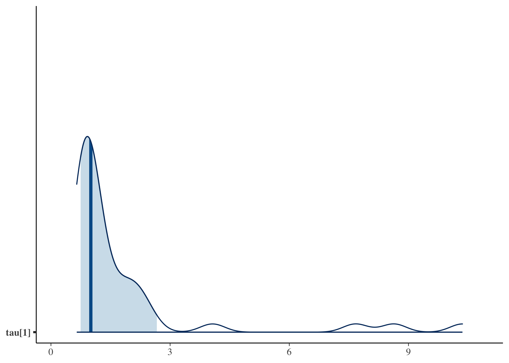
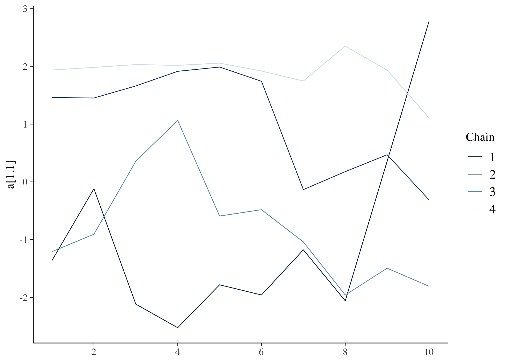
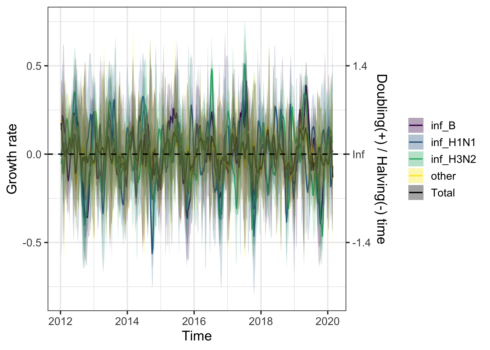
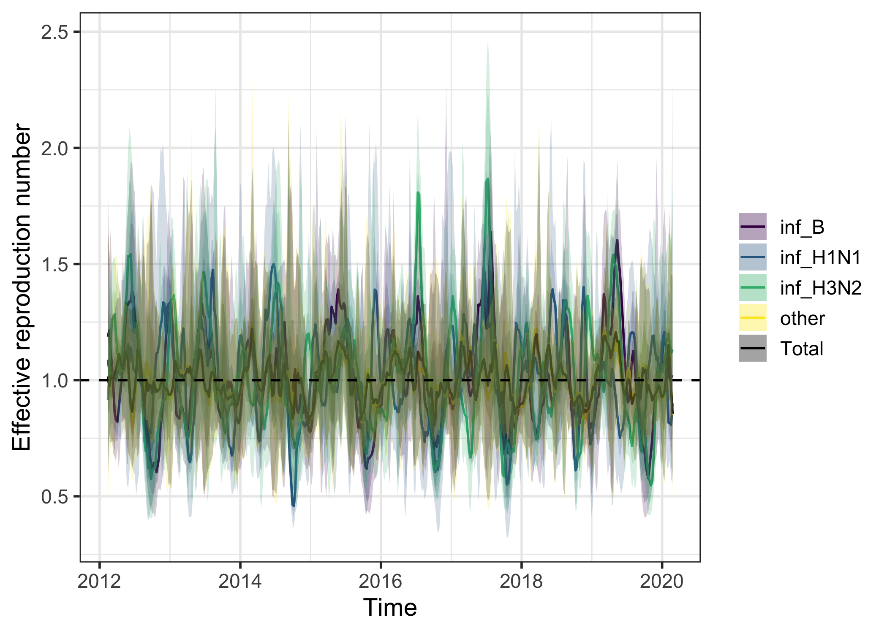
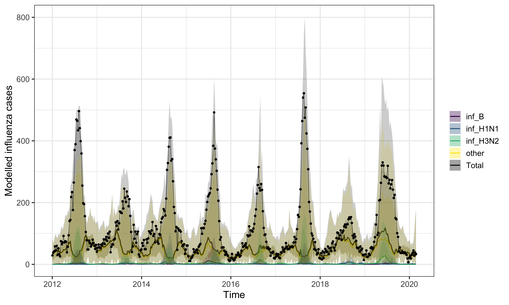
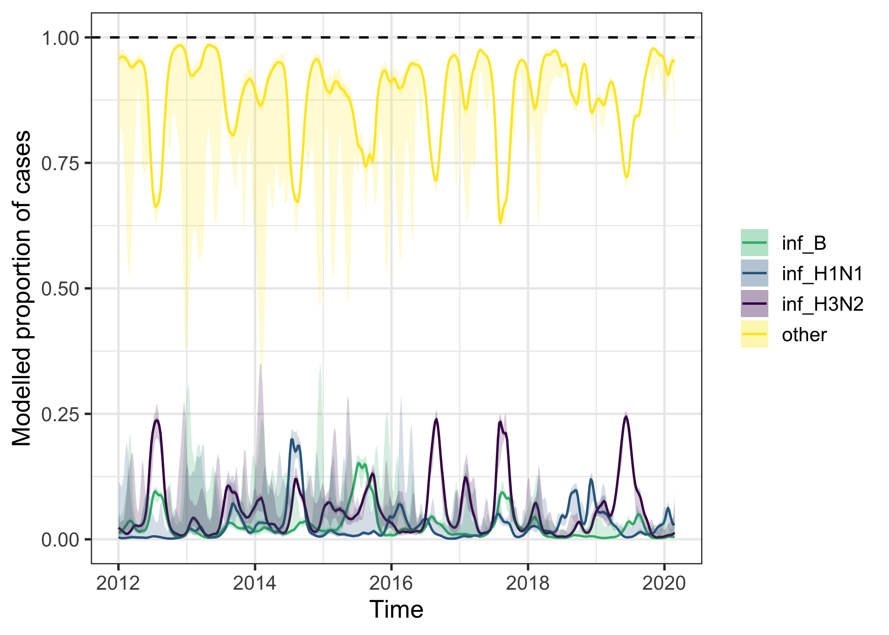
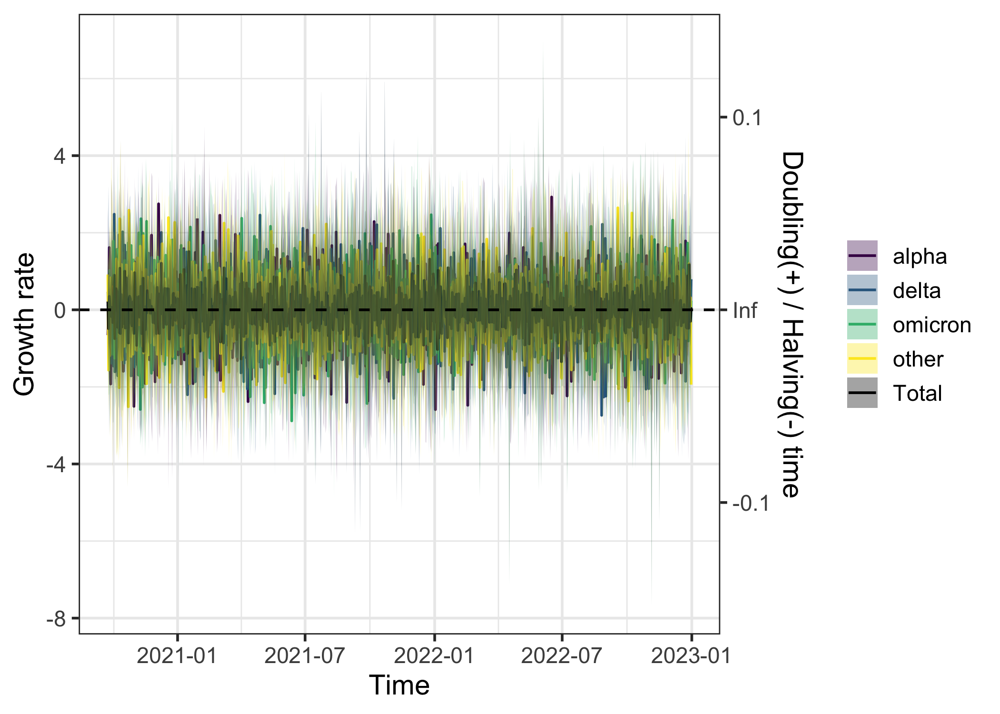
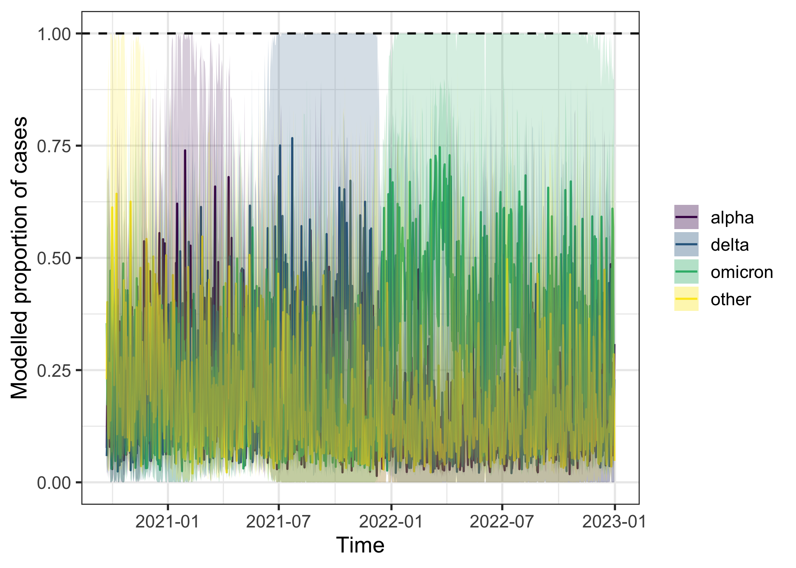

EpiStrainDynamics extends an existing statistical modelling framework capable of inferring the trends of up to two pathogens. The modeling framework has been extended here to handle any number of pathogens; fit to time series data of counts (eg, daily number of cases); incorporate influenza testing data in which the subtype for influenza A samples may be undetermined; account for day-of-the-week effects in daily data; include options for fitting penalized splines or random walks; support additional (optional) correlation structures in the parameters describing the smoothness of the penalized splines (or random walks); and account for additional (optional) sources of noise in the observation process.

# Step 1: Construct model

These modelling specifications are specified using the `construct_model` function. The correct stan model is then applied based on the specifications provided. `construct_model()` requires specification of the `method` and `pathogen_structure`, and allows the user to additionally specify four arguments related to model design: `smoothing_params`, `dispersion_params`, `pathogen_noise`, and `dow_effect`. We will break these down one by one.

## Method

EpiStrainDynamics has pre-compiled stan models that fit either with bayesian penalised splines or random walks. These are specified using the `method` argument of `construct_model()` as functions, either with `random_walk()` or `p_spline()`. The penalised spline model has two further options to specify: `spline_degree` is the polynomial degree of the individual spline segments used to construct the overall curve (must be a positive whole number) and `days_per_knot`, which is the number of days for each knot (must also be a positive whole number).

So we may specify:
```
method = random_walk(),

# OR

method = p_spline(spline_degree = 3,  # example value for spline degree
                  days_per_knot = 2)  # example value for days per knot
```

## Pathogen structure

There are three main types of pathogen structure available to model: `single()`, `multiple()`, and `subtyped()`.
These functions require the name of the dataset itself and the column names for different data elements. These can also ingest timeseries class objects, which would then make the `time` column specification optional. Any timeseries class input that is handled by the [`tsbox` package](https://docs.ropensci.org/tsbox/reference/tsbox-package.html) is acceptable. The models are not currently equipped to handle missing values or irregular date sequences.

The `single()` pathogen structure is the simplest and models a single pathogen timeseries. The name of the dataframe is passed to argument `data`, the name of the column with total case data is passed to `case_timeseries`, and the name of the column of time data is passed to `time` (optional if input dataset is a timeseries class). It can be specified as follows, illustrated using data provided with the package `sarscov2`:

```
pathogen_structure = single(
  data = sarscov2,                    # dataframe
  case_timeseries = 'cases',          # timeseries of case data
  time = 'date'                       # date or time variable
)
```

The `multiple()` pathogen structure allows modelling of different component pathogens. In addition to specifying `data`, `case_timeseries`, and `time` (optional if input dataset is a timeseries class), these additional pathogens are specified as a vector of column names with the argument `component_pathogen_timeseries`. Example pathogen structure specification for multiple pathogens model using the `sarscov2` dataset:

```
pathogen_structure = multiple(
  data = sarscov2,                         # dataframe
  case_timeseries = 'cases',               # timeseries of case data
  time = 'date',                           # date or time variable labels

  component_pathogen_timeseries = c(       # vector of column names of
    'alpha', 'delta', 'omicron', 'other'   #   component pathogens
  )
)
```

The `subtyped()` pathogen structure enables additional complexity specifically for an influenza modelling scenario by allowing the user to incorporate testing data for influenza A subtypes. The unsubtyped column is specified with `influenzaA_unsubtyped_timeseries`, and the subtyped data are specified with vector of column names of provided to `influenzaA_subtyped_timeseries`. Additional pathogens are provided as a vector of column names to `other_pathogen_timeseries`. Example pathogen structure specification for subtyped model using the `influenza` dataset included in the package:

```
pathogen_structure = subtyped(
  data = influenza,                            # dataframe
  case_timeseries = ili,                       # timeseries of case data
  time = week,                                 # date or time variable labels

  influenzaA_unsubtyped_timeseries = 'inf_A',  # unsubtyped influenzaA
  influenzaA_subtyped_timeseries = c(          # subtyped influenzaA
    'inf_H3N2', 'inf_H1N1'
  ),
  other_pathogen_timeseries = c(               # other pathogens
    'inf_B', 'other'
  )
)
```

## Smoothing parameters

The argument `smoothing_params` allows users to modify the correlation structures in the parameters describing smoothness and set related priors. These are specified with the function `smoothing_structure()` that requires the user to specify a `smoothing_type` that is either `shared` (all pathogens have the same smoothness), `independent` (each pathogen has completely independent smoothing structure), or `correlated` (smoothing structure is correlated among pathogens). For `shared` or `independent` smoothing types parameters for the mean and standard deviation of the prior on tau can also be specified, as below:

```
smoothing_params = smoothing_structure(
  smoothing_type = 'independent',
  tau_mean = c(0, 0.1, 0.3, 0),
  tau_sd = rep(1, times = 4)
)
```

## Dispersion parameters

The argument `dispersion_params` allows users to set a prior for the overdispersion parameter, `phi`, of the negative binomial likelihood for the case timeseries. This parameter controls how much the reported case count can vary from day to day around the model's expected value. Even if the model's smooth trend exactly captured the true expected number of cases on a given day, the actual reported count would still vary, since it depends on which patients happened to seek care, get tested, or have their test processed and reported that day. A negative binomial (rather than Poisson) likelihood is used because real surveillance counts are almost always more variable than a simple random-sampling process would predict, a pattern known as overdispersion. Smaller `phi` allows more day-to-day variation in reported counts; larger `phi` keeps them closer to the trend.

It is specified using `dispersion_structure()` as below:

```
dispersion_params = dispersion_structure(
  phi_mean = 0, phi_sd = 1
)
```

## Pathogen noise

By default, the model assumes that on any given day, the relative mix of pathogens follows exactly the smooth underlying trends, and that any noisiness in the observed composition (e.g. how many positive tests were pathogen A vs. B) comes only from the day-to-day reporting variation described with `phi`, above.

It is possible to add an extra source of variability, allowing the *true* day-to-day mix of pathogens to jitter around the smooth trend, not just the observed counts. This matters because real pathogens don't necessarily move in lockstep with a single shared epidemic curve; one pathogen can genuinely spike or dip relative to the others for reasons the smooth trend alone doesn't capture.

The argument `pathogen_noise` refers to whether to include this noise between individual pathogens and can be specified as a logical (`TRUE` or `FALSE`).

## Day of week effect

Surveillance data reported by calendar day often show a weekly pattern that has nothing to do with disease transmission, for example, fewer specimens processed or reported over weekends due to lab and clinic schedules.

Day of week effect is specified as a logical (`TRUE` or `FALSE`) to the `dow_effect` argument. Setting `dow_effect = TRUE` fits a separate multiplier for each day of the week, so these reporting-schedule artifacts are absorbed by the day-of-week terms rather than being mistaken for genuine changes in the epidemic trend. In plotting the day of week effect can be selectively removed.

## Worked example

A full worked example using a subtyped structure:


``` r
mod <- construct_model(

  method = p_spline(),

  pathogen_structure = subtyped(
    data = influenza,
    case_timeseries = 'ili',
    time = 'week',
    influenzaA_unsubtyped_timeseries = 'inf_A',
    influenzaA_subtyped_timeseries = c('inf_H3N2', 'inf_H1N1'),
    other_pathogen_timeseries = c('inf_B', 'other')
  ),

  smoothing_params = smoothing_structure(
    'independent', tau_mean = c(0, 0.1, 0.3, 0), tau_sd = rep(1, times = 4)),
  dispersion_params = dispersion_structure(phi_mean = 0, phi_sd = 1),
  pathogen_noise = FALSE,
  dow_effect = TRUE
)
```

## Output

The constructed model object is a named list containing the formatted data to be modelled, accessed with `$data`, a timeseries object of class `tsibble` that has been validated for gaps and regularity, accessed with `$validated_tsbl`, parameter values structured for the stan interface (such as smoothing structure, observation noise, and penalised spline parameters, if appropriate), accessed with `model_params`, names of provided pathogens, accessed with `pathogen_names`, and record of whether day of week effect has been selected, accessed with `dow_effect`.

# Step 2: Fit model

The model estimates the expected value of the time series (eg, a smoothed trend in the daily number of cases accounting for noise) for each individual pathogen. Model parameterisation decisions specified when constructing the model in step 1 mean the correct stan model will be applied at this stage by simply calling `fit_model()` onto the constructed model object.


``` r
fit <- fit_model(
  mod,
  n_iter = 20,
  n_warmup = 10,
  verbose = FALSE
)
#> Warning: Very few effective samples will be retained after thinning
#> ℹ With `n_iter` = 20, `n_warmup` = 10, `thin` = 1, and `n_chain`
#>   = 4
#> ℹ Only 40 samples will be retained
#> ℹ Consider reducing `thin` or increasing `n_iter`
#> Warning: There were 4 chains where the estimated Bayesian Fraction of Missing Information was low. See
#> https://mc-stan.org/misc/warnings.html#bfmi-low
#> Warning: Examine the pairs() plot to diagnose sampling problems
#> Warning: The largest R-hat is 2.76, indicating chains have not mixed.
#> Running the chains for more iterations may help. See
#> https://mc-stan.org/misc/warnings.html#r-hat
#> Warning: Bulk Effective Samples Size (ESS) is too low, indicating posterior means and medians may be unreliable.
#> Running the chains for more iterations may help. See
#> https://mc-stan.org/misc/warnings.html#bulk-ess
#> Warning: Tail Effective Samples Size (ESS) is too low, indicating posterior variances and tail quantiles may be unreliable.
#> Running the chains for more iterations may help. See
#> https://mc-stan.org/misc/warnings.html#tail-ess
```

The output of this function is a list with the stan fit object, accessed with `$fit`, and the elements of the constructed model object from the previous step, accessed with `$constructed_model`.

# Step 3: Check fit

A summary of model convergence diagnostics can be viewed using:


``` r
diagnose_model(fit)
#> Model Convergence Diagnostics
#> =============================
#> Overall convergence: ISSUES DETECTED 
#> Maximum R-hat: 3.03 
#> Minimum n_eff: 3
```

Beyond this summary, the stan fit object can be interrogated with any package that works with stan outputs. For example, one could visualise posteriors with the package `bayesplot`:


``` r
bayesplot::mcmc_areas(as.matrix(fit$fit), pars = 'tau[1]', prob = 0.8)
```



The `bayesplot` package can also be used to evaluate convergence:


``` r
bayesplot::mcmc_trace(rstan::extract(fit$fit, permuted = FALSE), pars = c('a[1,1]'))
```



Or else the application `shinystan` is a great tool to visualise the fit and diagnose issues:

```
library(shinystan)
launch_shinystan(fit$fit)
```

Model not converging? You can find more information about divergent transitions [here](https://mc-stan.org/docs/2_19/reference-manual/divergent-transitions). Some quick tips:

* Increase the `adapt_delta` parameter in fit_model(), which governs how big the steps are in the MCMC.
* Try reducing the complexity of the model. For example, by using `pathogen_noise = FALSE` or a shared smoothing structure.
* Increase the number of warmup samples with the n_warmup parameter.

# Step 4: Calculate and explore epidemiological quantities

The package provides helper functions to calculate a number of useful epidemiological quantities. The output of these methods functions are a named list containing a tsibble of the outcome quantity (`$measure`), the fit object (`$fit`), and the constructed model object (`$constructed_model`). `measure` is a tsibble containing the median of the epidemiological quantity (`y`), the 50% credible interval of the quantity (`lb_50` & `ub_50`), the 95% credible interval (`lb_95` & `ub_95`), the proportion greater than a defined threshold value (`prop`), the pathogen name (`pathogen`), and the time index (`time`).

Calculate epidemic growth rate with `growth_rate()`:

``` r
gr <- growth_rate(fit)
head(gr$measure)
#> # A tsibble: 6 x 9 [7D]
#> # Key:       pathogen [1]
#>   pathogen pathogen_idx        y    lb_50  ub_50  lb_95 ub_95
#>   <chr>           <int>    <dbl>    <dbl>  <dbl>  <dbl> <dbl>
#> 1 Total              NA 0.177     0.0783  0.244  -0.159 0.417
#> 2 Total              NA 0.119    -0.00736 0.188  -0.146 0.350
#> 3 Total              NA 0.0409   -0.0311  0.126  -0.115 0.331
#> 4 Total              NA 0.0436   -0.0917  0.127  -0.409 0.298
#> 5 Total              NA 0.0243   -0.0853  0.117  -0.528 0.406
#> 6 Total              NA 0.000323 -0.111   0.0634 -0.391 0.407
#> # ℹ 2 more variables: prop <dbl>, time <date>
plot(gr)
```



Calculate effective reproduction number over time with `Rt()` (requiring specification of a generation interval distribution):

``` r
rt <- Rt(fit, gi_dist = function(x) 4*x*exp(-2*x))
plot(rt)
```



Calculate incidence with or without a day of week effect with `incidence()`:

``` r
inc_dow <- incidence(fit, dow = TRUE)
plot(inc_dow)
```



Calculate proportions of different combinations of cases attributable to different pathogens/subtypes using `proportion()`. By default, the function will return a dataframe with proportions of each pathogen or subtype out of all pathogens/subtypes. Alternatively, one can specify a selection of pathogens/subtypes by their names in the named lists provided to `construct_model()`:
```
prop <- proportion(
  fit,
  numerator_combination = c('inf_H3N2', 'inf_H1N1'),
  denominator_combination = c('inf_H3N2', 'inf_H1N1', 'inf_B', 'other')
)
```


``` r
prop <- proportion(fit)
plot(prop)
```



# Additional worked example: COVID-19

The worked example above uses influenza data with a subtyped pathogen structure and penalised splines. To illustrate a different combination, the following constructs and fits a random walk model to the `sarscov2` dataset bundled with the package, using the `multiple` pathogen structure to model the different SARS-CoV-2 variants circulating over time.


``` r
mod_covid <- construct_model(
  method = random_walk(),

  pathogen_structure = multiple(
    data = sarscov2,
    case_timeseries = 'cases',
    time = 'date',
    component_pathogen_timeseries = c('alpha', 'delta', 'omicron', 'other')
  ),

  smoothing_params = smoothing_structure(
    'independent', tau_mean = c(0, 0.1, 0.3, 0), tau_sd = rep(1, times = 4)),
  dispersion_params = dispersion_structure(phi_mean = 0, phi_sd = 1),
  pathogen_noise = FALSE,
  dow_effect = TRUE
)

fit_covid <- fit_model(
  mod_covid,
  n_iter = 20,
  n_warmup = 10,
  verbose = FALSE
)
#> Warning: Very few effective samples will be retained after thinning
#> ℹ With `n_iter` = 20, `n_warmup` = 10, `thin` = 1, and `n_chain`
#>   = 4
#> ℹ Only 40 samples will be retained
#> ℹ Consider reducing `thin` or increasing `n_iter`
#> Warning: There were 2 divergent transitions after warmup. See
#> https://mc-stan.org/misc/warnings.html#divergent-transitions-after-warmup
#> to find out why this is a problem and how to eliminate them.
#> Warning: There were 3 transitions after warmup that exceeded the maximum treedepth. Increase max_treedepth above 10. See
#> https://mc-stan.org/misc/warnings.html#maximum-treedepth-exceeded
#> Warning: There were 4 chains where the estimated Bayesian Fraction of Missing Information was low. See
#> https://mc-stan.org/misc/warnings.html#bfmi-low
#> Warning: Examine the pairs() plot to diagnose sampling problems
#> Warning: The largest R-hat is 4.6, indicating chains have not mixed.
#> Running the chains for more iterations may help. See
#> https://mc-stan.org/misc/warnings.html#r-hat
#> Warning: Bulk Effective Samples Size (ESS) is too low, indicating posterior means and medians may be unreliable.
#> Running the chains for more iterations may help. See
#> https://mc-stan.org/misc/warnings.html#bulk-ess
#> Warning: Tail Effective Samples Size (ESS) is too low, indicating posterior variances and tail quantiles may be unreliable.
#> Running the chains for more iterations may help. See
#> https://mc-stan.org/misc/warnings.html#tail-ess
```

As before, growth rate and pathogen proportions can be calculated and plotted directly from the fit:


``` r
gr_covid <- growth_rate(fit_covid)
plot(gr_covid)
```




``` r
prop_covid <- proportion(fit_covid)
plot(prop_covid)
```



